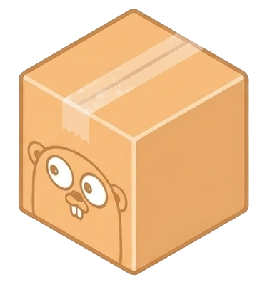
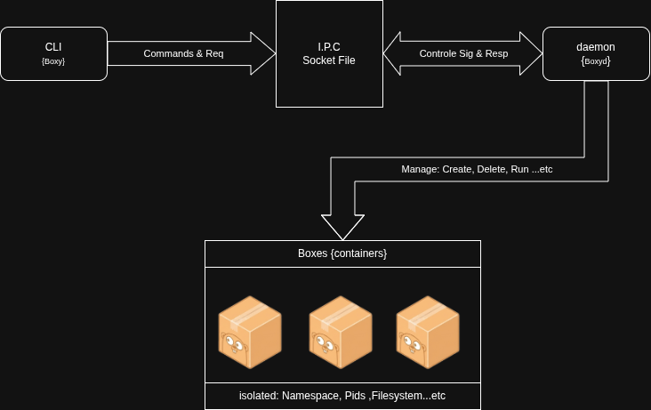

# Boxy

<div align="center">
	
	<br/>
	
	
</div>

---

Boxy is a lightweight containerization system built to run isolated applications using core Linux features. It uses namespaces, cgroups, and filesystem isolation to create independent environments. Designed for simplicity and learning, Boxy demonstrates how container runtimes manage processes, resources, and system isolation.


## Features


- Run applications in isolated containers ("boxes")
- Uses Linux namespaces for process/resource isolation
- Simple image format (JSON + rootfs)
- CLI and daemon architecture
- List, start, stop, and remove containers
- List available images (`images` command)

## Todo
- [ ] Add more features (networking, volumes, etc.)
- [ ] Implement a real image registry server
- [ ] Improve error handling and logging
- [ ] Add more documentation and examples
- [ ] Optimize performance and resource management
- [ ] add Gui interface (maybe)
- [ ] create a tutorial for building your own containerization system `ASAP` 


## Architecture

The following diagram illustrates the high-level architecture of Boxy:

<div align="center">
  
</div>

Boxy uses a client-server model: the CLI communicates with the daemon via IPC, and the daemon manages containers (boxes), images, and runtime environments using Linux kernel features.

## Project Structure

```
boxy/
├── cmd/                # Entrypoints for CLI and daemon
│   ├── cli/            # CLI main
│   ├── daemon/         # Daemon main
├── internal/           # Main application logic
│   ├── box/            # Box/container and image logic
│   ├── cli/            # CLI command handlers
│   ├── config/         # Configuration
│   ├── daemon/         # Daemon handlers
│   ├── ipc/            # IPC protocol and server
│   ├── runtime/        # Runtime logic & memory management
│   └── utils/          # Utilities
├── registry/           # Local image registry (image.json, rootfs)
├── env/                # Box/container environments (runtime data)
├── docs/               # Documentation and images
├── Makefile            # Build instructions
├── LICENSE             # License
└── README.md           # This file
```

Each folder contains Go code or data for a specific part of the system. See comments above for details.

## Installation

Clone the repository and build the CLI and daemon:

```sh
git clone https://github.com/Ox03bb/boxy.git
cd boxy

make build
```

This will build two binaries: `boxy` (CLI) and `boxyd` (daemon).

## Usage

Start the daemon in the background:
> may require root privileges to run depending on your system configuration & your distro

```sh
./boxyd &
```

Run a new box (container):

```sh
./boxy --help

Boxy CLI

Usage:
  boxy [command]

Available Commands:
  attach      Attach to a running box
  completion  Generate the autocompletion script for the specified shell
  exec        Run a command in a running box (like docker exec)
  help        Help about any command
  images      List available images
  logs        Show logs for a box (streams PTY output)
  ps          List running boxes
  rm          Remove a box by ID or name
  run         Create and start a new box from an image
  start       Start a stopped/exited box
  stop        Stop (kill) a running box but keep rootfs and metadata

```


## Images

Images are stored in the `registry/` directory. Each image has a folder (e.g., `registry/ubuntu/`) with an `image.json` file and a root filesystem.
> this is just prouf of concept, should add to the project a real registry server.


## License

This project is licensed under the GPLv3. See [LICENSE](LICENSE).

---

*Boxy is for educational and experimental use. Not intended for production.*


